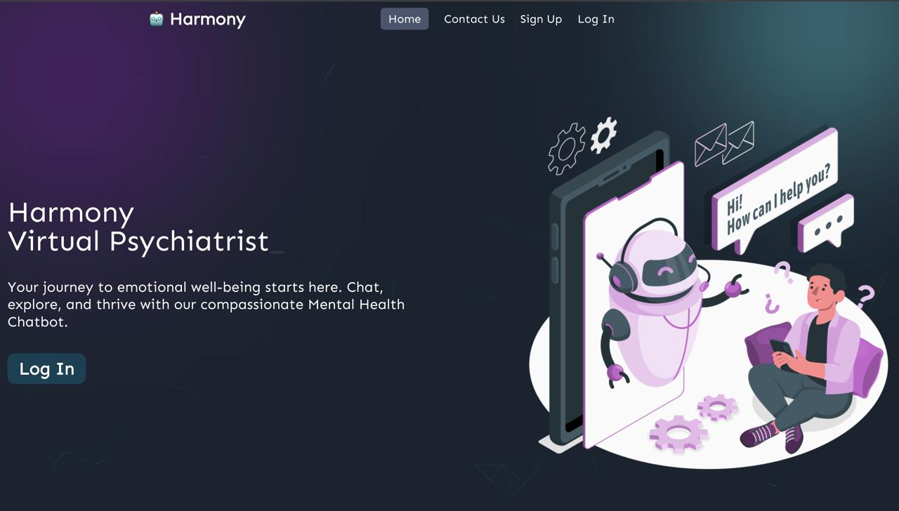

# Virtual-Psychiatrist
Virtual Psychiatrist

 - - - -
### Introduction

The use of artificial intelligence (AI) in healthcare has revolutionized the provision of mental health support in recent years. Natural language processing (NLP)-based chatbots have become powerful tools for offering timely support. This study looks on the development, application, and evaluation of a GPT-2-focused chatbot that was created with psychological considerations in mind. With the help of a wealth of textual data from Hugging Face and other websites, the chatbot can effectively handle user requests because it has been trained on a wide range of contextually appropriate content. The methodical approach covered in this article comprises approaches for data extraction, cleaning, visualization, training, and assessment. A portion of this procedure is evaluating language coherence and semantic understanding using metrics like as DistilBERT Cosine Similarity. Additionally, the integration of FastAPI for backend services, MongoDB for data storage, and ReactJS for front-end development ensures user-friendly interfaces, accessible communication, and efficient data management. These elements improve efficacy and transparency in the mental health services sector. The chatbot's name is "Harmony". Its purview encompasses offering coping strategies, counseling for stress, anxiety, and depression, and serving as a point of contact for mental health and emergency support. Traditional therapy is improved by continuing to monitor and support the patient. 

- - - -
### Technologies Used
1.	**Front-end**
    - React.js: A JavaScript library for building user interfaces.
    - Tailwind CSS: It is a class with all the CSS properties written in a different way which can directly be used with simple shorthand.
    - Particle.js: A lightweight JavaScript library for creating interactive particle animations on a webpage.
2.	**Back-end**
    - Fast API: An efficient framework for building python APIs. It is much faster than any other python framework like Flask and Django. Fast API provides the flexibility of building large applications with high performance.
3.	**Machine-Learning**
    - PyTorch: A free and open-source library for machine learning and deep learning with more advanced built-in libraries to be utilized directly to ease the task of machine learning.
    - Transformers: The Transformers library enables developers to create sophisticated natural language processing (NLP) applications with minimal effort with pre-defined architecture.
4.	**Database Technologies**
    - MongoDB: A powerful NoSQL database system that efficiently stores unstructured data.
    - MongoDB Engine (MongoEngine): A Python Object-Document Mapper (ODM) library for MongoDB, facilitating interaction with MongoDB databases in Python applications.
5.	**Deployment Technologies**
    - Atlas: MongoDB Atlas is a MongoDB-created, managed, multi-cloud database service that simplifies deployment, management, and scaling, enabling developers to build resilient, high-performance applications across various cloud providers.
    - AWS EC2: Resizable, secure compute capacity is made possible by AWS EC2, which is perfect for implementing applications with scalable, on-demand infrastructure.

- - - -
### Methodologies
1.  **Literature Review**
    - Transformers and Large Language Models
    - PyTorch
    - GPT (Generative Pre-trained Transformers):
    - Text Generation
2.  **Data Preprocessing**
    - Named Entity Removal
    - Text Translation from Chinese (SMILE Dataset) to English
    - Enhance the Beginning of the Conversation with Greetings
    - Merge Under Specific Format
3. **Data Exploration and Visualization**
    - Unigrams and Bigrams
    - Word Cloud
    - Latent Dirichlet Allocation (LDA)
    - Intent Classification
3. **Methods Used**
    - Tokenization
    - Model Training
    - Model Evaluation and Testing
        - BLEU Score
        - ROUGE Score
        - DistilBERT Cosine Similarity Score

- - - -
### Result
1. **Landing Page**
   
3. **Sign Up Page**
4. **Login Page**
5. **Chat History**
6. **Chat Screen and Conversation**
7. **Evaluation Results**
    - Evaluation Metrics: Comparing responses from ChatGPT-4 and the proposed model.
      Intent             | BLUE        | ROUGE     | Cosine Similarity
      ------------------ | ----------- | --------- | -------------
      **Stress**         | 0.013695    | 0.173437  | 0.651334
      **Anxity**         | 0.017301    | 0.171054  | 0.611296
      **Depression**     | 0.011467    | 0.160048  | 0.601141
      **Greeting**       | 0.018578    | 0.096368  | 0.479845
      **Social Anxity**  | 0.009661    | 0.119167  | 0.596898
      **Others**         | 0.013368    | 0.154787  | 0.507061

- - - -
### References
* Garreau, V. (n.d.). particles.js - A lightweight JavaScript library for creating particles. particles.js - a Lightweight JavaScript Library for Creating Particles. https://vincentgarreau.com/particles.js/
* FastAPI. (n.d.). https://fastapi.tiangolo.com/
* Tailwind CSS - Rapidly build modern websites without ever leaving your HTML. (n.d.). Tailwind CSS. https://tailwindcss.com/
* What is a Transformer Model? | IBM. (n.d.). Retrieved March 31, 2024, from https://www.ibm.com/topics/transformer-model
* Alvi, F. (2024, January 24). PyTorch vs TensorFlow in 2024: A Comparative Guide of AI Frameworks. OpenCV. Retrieved March 31, 2024, from https://opencv.org/blog/pytorch-vs-tensorflow/#:~:text=PyTorch%20vs%20TensorFlow%3A%20Both%20are,for%20beginners%20and%20rapid%20prototyping.
* Santhosh, S. (2023, April 17). Understanding BLEU and ROUGE score for NLP evaluation. Medium. https://medium.com/@sthanikamsanthosh1994/understanding-bleu-and-rouge-score-for-nlp-evaluation-1ab334ecadcb
* sentence-transformers/distilbert-base-nli-mean-tokens · Hugging Face. (n.d.). https://huggingface.co/sentence-transformers/distilbert-base-nli-mean-tokens
* dslim/distilbert-NER · Hugging Face. (2001, January 18). https://huggingface.co/dslim/distilbert-NER
* jerryjalapeno/nart-100k-synthetic · Datasets at Hugging Face. (2001, February 20). https://huggingface.co/datasets/jerryjalapeno/nart-100k-synthetic
* alexandreteles/mental-health-conversational-data · Datasets at Hugging Face. (2023, September 27). https://huggingface.co/datasets/alexandreteles/mental-health-conversational-data
* Amod/mental_health_counseling_conversations · Datasets at Hugging Face. (2001, March 4). https://huggingface.co/datasets/Amod/mental_health_counseling_conversations
* Riyazmk/mentalhealth · Datasets at Hugging Face. (n.d.). https://huggingface.co/datasets/Riyazmk/mentalhealth
* mpingale/mental-health-chat-dataset · Datasets at Hugging Face. (n.d.). https://huggingface.co/datasets/mpingale/mental-health-chat-dataset
* jkhedri/psychology-dataset · Datasets at Hugging Face. (2023, October 6). https://huggingface.co/datasets/jkhedri/psychology-dataset
* Papers with Code - PsyQA Dataset. (n.d.). https://paperswithcode.com/dataset/psyqa
* EmoCareAI/Psych8k · Datasets at Hugging Face. (n.d.). https://huggingface.co/datasets/EmoCareAI/Psych8k
